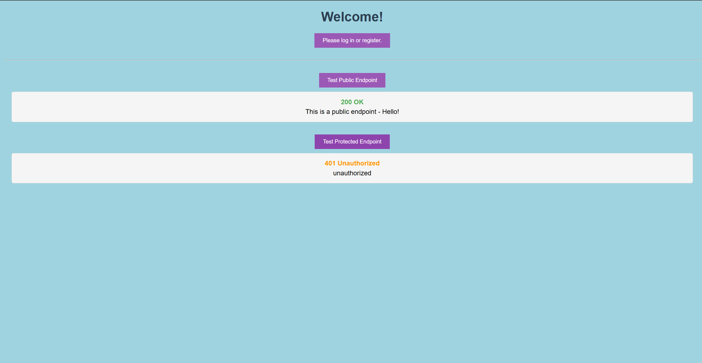
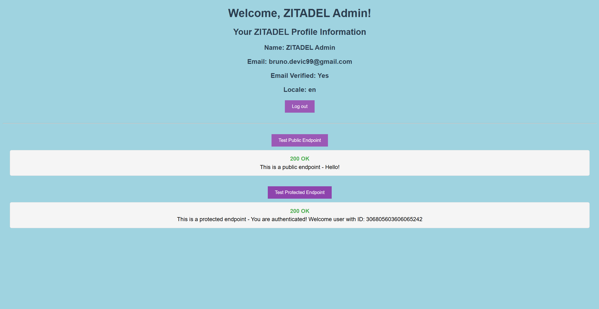
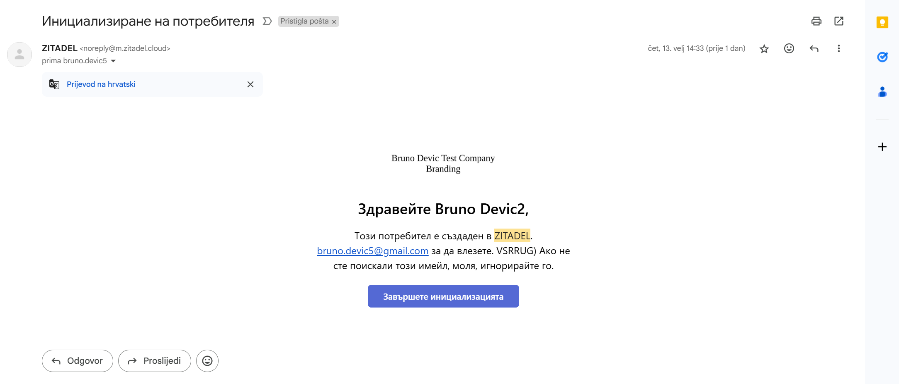
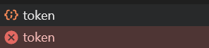

# ZITADEL Authentication Demo

This project demonstrates OAuth 2.0 authentication using ZITADEL with a React frontend and Go backend. The frontend implementation is based on [ZITADEL's React authentication example](https://github.com/zitadel/react-user-authentication) and their [OAuth implementation guide](https://www.youtube.com/watch?v=5THbQljoPKg) and by following the instructions from the [ZITADEL Go example](https://zitadel.com/docs/examples/secure-api/go) and other onboarding materials.

## Features

- React frontend with ZITADEL authentication
- Go backend with two endpoints:
  - Public endpoint (accessible without authentication)
  - Protected endpoint (requires valid ZITADEL authentication)
- Docker containerization for both frontend and backend
- CORS configuration for secure communication

## Project Structure

The project is organized into two main directories:

- `frontend`: Contains the React application code
- `backend`: Contains the Go application code

## Prerequisites

- Docker and Docker Compose
- ZITADEL key.json file (you will receive this via email)
  - Place the received key.json file in the `backend` folder before running the application
  - Note: This file contains sensitive authentication information and should not be pushed
- Available ports:
  - Port 3000 for the frontend application
  - Port 8080 for the backend service
  - Please ensure these ports are not in use by other applications

## Quick Start

1. Clone the repository:
 ```bash
   git clone https://github.com/DevicBruno/zitadel-task
 ```

2. Place the ZITADEL key.json file (received via email) in the `backend` folder:
 ```bash
   cp /path/to/your/key.json backend/
 ```

3. Start the application using Docker Compose from the project's root directory:
 ```bash
   docker-compose up --build
 ```

4. Access the application:
   - Open your browser and navigate to `http://localhost:3000`
   - The frontend will be available and you can test both authenticated and public endpoints

## Application

The application consists of two buttons: one to call the public endpoint and another to call the protected endpoint. To access the protected endpoint, you need to be logged in or registered as a new user.

You can register or log in by clicking "Please log in or register."

Example of pressing both buttons while not logged in:


Example of pressing both buttons while logged in:


Messages shown below the status code are messages sent from the backend as a response to the request.

When you are logged in, you should be able to refresh the page and remain logged in. You can also log out and return to the login page.

## Architecture

### Frontend (React)
- Uses [ZITADEL's React authentication example](https://github.com/zitadel/react-user-authentication) as a starting point
- Added two buttons to test the authentication
- Fixed page refresh functionality when logged in

### Backend (Go)
- Written in Go following instructions from https://zitadel.com/docs/examples/secure-api/go
- Provides two endpoints to demonstrate authentication:
  - `/api/public`: Accessible without authentication
  - `/api/private`: Requires valid ZITADEL authentication token
- Supports graceful shutdown of the server
- Includes Makefile for easy linting and formatting

## Future Improvements

- Would add authorization code flow with backend
- Use a secret manager for storing the key.json file and other sensitive information
- Add tests (considered but there wasn't much logic to be tested)
- Consider using cookies instead of local storage for storing the token
- Add a proper logging system with levels (info, warning, error, etc.)

## Observations

The ZITADEL SDK for Golang and Admin dashboard are powerful and user-friendly tools that were intuitive from the start. I experimented with the branding features and was impressed by how easily you can modify colors and logos on the login page.

The onboarding materials were extremely useful and easy to follow.

## Issues Found

I encountered two minor issues:

1. When creating a new user, I received emails in an unfamiliar language/script (locale for this user was set to bg). This occurred for all locally created users.


2. After login, the frontend console shows two requests to the endpoint https://bruno-devic-interview-task-instance-ujvch7.us1.zitadel.cloud/oauth/v2/token. One request returns a 404 status code, while the other returns 200 OK.

