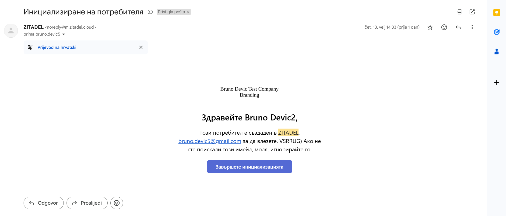
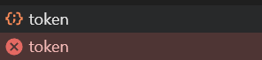

# ZITADEL Authentication Demo

This project demonstrates OAuth 2.0 authentication using ZITADEL with a React frontend and Go backend. The frontend implementation is based on [ZITADEL's React authentication example](https://github.com/zitadel/react-user-authentication) and their [OAuth implementation guide](https://www.youtube.com/watch?v=5THbQljoPKg) and by following the instructions from the [ZITADEL Go example](https://zitadel.com/docs/examples/secure-api/go) and other onboarding materials.

## Features

- React frontend with ZITADEL authentication
- Go backend with two endpoints:
  - Public endpoint (accessible without authentication)
  - Protected endpoint (requires valid ZITADEL authentication)
- Docker containerization for both frontend and backend
- CORS configuration for secure communication

## Project Structure

The project is organized into two main directories:

- `frontend`: Contains the React application code
- `backend`: Contains the Go application code


## Prerequisites

- Docker and Docker Compose

## Quick Start

1. Clone the repository:
   ```bash
   git clone https://github.com/DevicBruno/zitadel-task
   ```

2. Start the application using Docker Compose:
   ```bash
   docker-compose up --build
   ```

3. Access the application:
   - Open your browser and navigate to `http://localhost:3000`
   - The frontend will be available and you can test both authenticated and public endpoints

## Architecture

### Frontend (React)
- Uses [ZITADEL's React authentication example](https://github.com/zitadel/react-user-authentication) as a starting point
- Only addition to the page are 2 buttons to test the endpoints and authentication
- Small improvement / fix of refresh page not working when loged in, page was crashing

### Backend (Go)
- Written in Go by following instructions from the https://zitadel.com/docs/examples/secure-api/go
- Provides two endpoints to demonstrate authentication:
  - `/api/public`: Accessible without authentication
  - `/api/protected`: Requires valid ZITADEL authentication token
- Supports graceful shutdown of the server
- Has Makefile for easy lint and formatting

## Future improvements

- Add tests (thought about that but there were not much logic to be tested)
- Consider using cookies instead of local storage for storing the token
- Add a proper logging system with levels like info, warning, error, etc.

## Observations

ZITADEL SDK for Golang and Admin dashboard are very powerful and easy to use tools that were intuitive from the beginning. I played around a bit with it and really liked how branding is handled - really easy way to do big changes regarding your branding colors and logo on login - I even did my own.

Also, the onboarding materials were extremly useful and easy to follow.


## Issues found

There were just 2 smaller issues I stumbled upon. 

First one was that I got email on langunage / script I do not understand when I created new user (locale for this user was set to bg). Same goes for all the users I created locally.



Second one was, when looking into console on frontend after the login, I saw that frontend application from the example is sending 2 requests to the backend on endpoint https://bruno-devic-interview-task-instance-ujvch7.us1.zitadel.cloud/oauth/v2/token. One always returns 404, and other one returns 200 OK.

